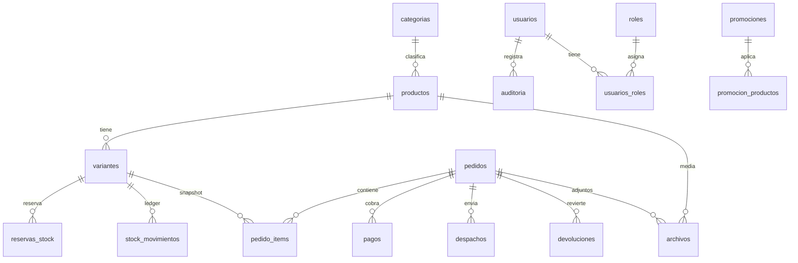

# Arquitectura de datos — tiendadeportivacchc.cl

Versión: 1.0  
Fecha: 2026-08-28  
Audiencia: implementación (Claude Code, Cursor) y decisión técnica CCHC  
Compañeros: `spec.md`, `data.md`, `CLAUDE.md`

Este documento **cierra** el tipo de base, el motor, archivos, inventario y la hoja de ruta. No se elige otra tecnología de núcleo sin enmendar aquí.

Estado del código hoy (v2): catálogo plano (1 producto = 1 stock), newsletter, visitas, checkout Mercado Pago, eventos. PGlite en local (dialecto Postgres) y PostgreSQL en producción.

---

## 1. Recomendación ejecutiva

El núcleo debe ser **relacional PostgreSQL**. Una tienda con carrito, variantes (talla/color), stock, pagos, pedidos, despachos, devoluciones, roles y promociones es un sistema **transaccional**: o el pedido, el cobro y el inventario quedan consistentes juntos, o no se confirma la venta.

- **No** usar NoSQL (Mongo, Dynamo, Firestore) como fuente de verdad de pedidos ni de stock.
- **No** usar una base vectorial (Pinecone, Weaviate, pgvector como producto) para el catálogo ni el cobro.
- **No** guardar fotos ni PDFs como `BYTEA` / blobs en la BD.
- **Sí** PostgreSQL para entidades, dinero, stock, FKs, CHECKs, auditoría y un JSONB **acotado**.
- **Sí** object storage (Cloudflare R2) para bytes; la BD solo guarda metadatos y la clave del objeto.
- Redis, buscador dedicado y vectores **solo** cuando un síntoma medible lo exija (ver §4 y la tabla de componentes).

Motor de la primera versión productiva: **PostgreSQL 16+** (Neon, Vercel Postgres o un managed equivalente). En local se mantiene **PGlite** mientras el SQL sea compatible; el día que PGlite se quede corto (reservas, `FOR UPDATE`, extensiones), el desarrollo local pasa a Postgres en Docker — no a otro paradigma.

Justificación breve:

| Criterio | Por qué Postgres gana aquí |
|---|---|
| Consistencia | `BEGIN`…`COMMIT` entre pedido, reserva de stock y pago |
| Seguridad | Roles SQL, sin schema-on-read ambiguo para dinero |
| Costo | Un servicio managed; sin clúster extra en el MVP |
| Mantenimiento | SQL estándar, backups, un esquema versionado |
| Crecimiento | JSONB, réplicas, `pg_trgm`; se suma Redis/R2/search **después** |

---

## 2. Diagrama de arquitectura

```
                    ┌─────────────┐
  Visitante ───────►│ Cloudflare  │  DNS, CDN, WAF, Turnstile
                    │  (borde)    │  R2 público (fotos catálogo)
                    └──────┬──────┘
                           │ HTTPS
                    ┌──────▼──────┐
                    │ Vercel /    │  HTML+JS  +  API Node
                    │ Express     │  secretos: MP, BD, R2
                    └──────┬──────┘
           ┌───────────────┼───────────────┐
           ▼               ▼               ▼
    ┌────────────┐  ┌────────────┐  ┌─────────────┐
    │ PostgreSQL │  │ R2 privado │  │ Mercado     │
    │ (núcleo)   │  │ adjuntos   │  │ Pago        │
    │ OLTP+JSONB │  │ pedidos    │  │ Checkout Pro│
    └────────────┘  └────────────┘  └─────────────┘

Más adelante (no MVP), si hay evidencia:
    Redis (caché / rate limit / TTL reservas)
    Meilisearch o pg_trgm (búsqueda)
    pgvector u otro (solo búsqueda semántica de catálogo)
```

Flujo de un pago (invariante):

1. API relee **precio y stock de Postgres** (nunca del browser).
2. Crea `pedidos` `pendiente` + `reservas_stock` (v3) o descuenta al `approved` (v2 actual).
3. Crea preferencia Mercado Pago; Access Token solo en servidor.
4. Webhook verifica firma, es **idempotente**, confirma pedido y cierra inventario.
5. Evento `purchase` lo escribe el backend.

---

## 3. Respuestas a las diez preguntas

### 3.1 Tipo de núcleo

**Relacional.** Pedidos, stock, pagos y devoluciones requieren ACID, FKs y restricciones. NoSQL encaja en carritos anónimos de corta vida o logs; no en el libro de inventario. Vectorial es un **índice de similitud**, no un sistema de registro.

### 3.2 Motor de la primera versión

**PostgreSQL.** Cubría ya el dialecto de v2 (PGlite). En producción: `DATABASE_URL` a Neon/Vercel Postgres (o RDS/Cloud SQL si más adelante hay ops propio). Un solo motor para catálogo, pedidos, usuarios admin, auditoría y JSONB.

No MySQL como default: JSONB, `RETURNING`, `FILTER`, exclusiones y el ecosistema Postgres/Neon encajan mejor con Vercel. No SQLite en producción: un escritor, sin el mismo modelo de concurrencia de stock.

### 3.3 Fotos y archivos (nunca blobs pesados)

| Qué | Dónde |
|---|---|
| Bytes (jpg, webp, pdf, guía de despacho) | Cloudflare R2 (S3 API) |
| Metadatos | Tabla `archivos` en Postgres: `bucket`, `clave`, `mime`, `bytes`, `checksum`, `visibilidad`, `entidad_tipo`, `entidad_id` |
| Catálogo | Objetos públicos o URL firmada larga + CDN |
| Adjuntos de pedido (boleta, foto de daño) | Bucket **privado**; descarga con URL firmada de 5–15 min tras autorización |

Local v2: SVG en `/media/:id.svg`. v3: mismo contrato de metadatos; el `url` pasa a ser clave R2.

### 3.4 Cuándo Redis, buscador o vectores

| Tecnología | Incorporar cuando | No incorporar si |
|---|---|---|
| **Redis** | Rate limit distribuido, caché de catálogo con p95 API alto, o TTL de reservas entre varias instancias | Una instancia de API y Postgres aguanta el tráfico |
| **Buscador (Meilisearch / Typesense)** | Catálogo de cientos de SKU, facetas talla/color lentas, typos | `pg_trgm` + filtros SQL bastan |
| **pg_trgm** (sigue siendo Postgres) | Búsqueda “zapatilla trail” mediocre con `LIKE` | — primer escalón, no un producto nuevo |
| **Base vectorial / pgvector** | Búsqueda por foto o “parecido a este producto” con embeddings | Nadie pidió esa UX; el catálogo es chico |

### 3.5 Tablas vs JSONB controlado

**Tablas (consulta, FK, money, stock):** categorías, productos, variantes/SKU, stock y movimientos, pedidos, ítems (snapshot), pagos, despachos, devoluciones, usuarios, roles, promociones, archivos, reservas, auditoría.

**JSONB permitido:**

- `eventos.payload` (extra no consultado como columna)
- `pagos.payload_pasarela` (cuerpo MP ya reducido; **sin** PAN ni CVV)
- `despachos.respuesta_courier` (tracking crudo)
- `variantes.atributos_extra` (peso, drop, material) **no** talla/color si se filtran
- `promociones.reglas` solo si la regla no cabe en columnas; el motor de descuento debe testearse

**Prohibido en JSONB:** `stock`, `precio` vigente, `estado` de pedido, `correo` del cliente, IDs de pago. Si se filtra o se cobra, es columna.

### 3.6 Inventario, reservas, pagos, pedidos, devoluciones

Modelo de cantidad (v3):

```
disponible = stock_fisico - stock_reservado
stock_fisico >= 0
stock_reservado >= 0
stock_reservado <= stock_fisico
```

| Evento | Efecto |
|---|---|
| Checkout | `INSERT reservas_stock` (TTL 15–30 min) + `stock_reservado += qty` si `disponible >= qty` (`UPDATE … WHERE disponible >= qty`) |
| Pago `approved` | Reserva → venta: `stock_fisico -= qty`, `stock_reservado -= qty`; `pedidos.estado = pagado`; movimiento `venta` |
| Pago fallido / TTL | `stock_reservado -= qty`; reserva `expirada` |
| Webhook duplicado | Idempotencia por `mp_payment_id` / `idempotency_key` |
| Devolución aceptada | Movimiento `devolucion`; `stock_fisico += qty` si la unidad vuelve a venta |

v2 actual descuenta **solo** en `approved` (sin reserva). Eso admite sobreventa si dos checkouts coinciden. v3 introduce reserva **antes** de redirigir a MP.

Trazabilidad: tabla `stock_movimientos` (nunca borrar; no “update in place” del historial). `pedido_items` guarda snapshot de nombre, SKU, talla, color, precio_unitario.

Dinero: CLP entero. El cliente **no** manda el precio a cobrar.

### 3.7 Protección de archivos, PII, descargas y pagos

- Access Token MP, secretos R2 y `DATABASE_URL` solo en env; nunca en JS.
- Webhook MP: verificar firma; no cachear; responder 200 idempotente.
- PII (correo, teléfono, dirección): mínimo necesario; consentimiento; baja; acceso admin con rol.
- Archivos públicos ≠ adjuntos de pedido. Firmado + `Content-Disposition` + expiración.
- Autorización: el token de descarga no es la clave R2 eterna.
- Admin: sesión servidor (o JWT httpOnly de vida corta) + roles; no “ocultar” rutas en el front.
- Ley 19.628: finalidad, consentimiento, no reutilizar correos de newsletter para otro fin sin base.

### 3.8 Índices, restricciones, FKs, auditoría (esenciales)

**Restricciones:** PK, UNIQUE (`productos.slug`, `variantes.sku`, `pedidos.codigo`, `suscriptores.correo`, `pagos.mp_payment_id`), CHECK de stock y montos ≥ 0, FK con `ON DELETE` restrictivo en pedidos/ítems (no borrar historial).

**Índices:** `productos(categoria_id)`, `variantes(producto_id)`, `pedidos(estado, created_at)`, `pagos(mp_payment_id)`, `eventos(nombre, ocurrido_at DESC)`, `archivos(entidad_tipo, entidad_id)`, `reservas_stock(variante_id, estado)`, `stock_movimientos(variante_id, created_at)`.

**Auditoría v3:** `auditoria` (quién, qué tabla, acción, `diff jsonb`, `at`). Usuarios admin obligatorios para writes de catálogo. No `DELETE` físico de pedidos.

### 3.9 Riesgos de “todo NoSQL / vector / blob en la BD” desde el día 1

| Enfoque | Qué se rompe |
|---|---|
| NoSQL como núcleo | Sobreventa, pedidos huérfanos, informes de plata inconsistentes, migraciones dolorosas |
| Vector como catálogo | No hay transacción de stock; costo fijo; no sirve para cobros |
| Fotos en BYTEA | Backups gigantes, API lenta, no CDN, restores eternos |
| Microservicios + 4 bases | Complejidad de ops sin tráfico que la pague |

### 3.10 Hoja de ruta

| Fase | Qué | Tecnología extra |
|---|---|---|
| **MVP (v2 — hecho)** | Catálogo plano, newsletter, visitas, MP, eventos | Postgres/PGlite, SVG local |
| **Crecimiento (v3)** | Variantes, reserva de stock, R2, admin+roles, promociones simples, despacho, devoluciones | R2; Postgres sigue siendo el único OLTP |
| **Escala** | Caché, búsqueda, réplica de lectura, colas de webhook | Redis y/o Meilisearch **si** hay métrica; pgvector **si** hay UX semántica |

---

## 4. Modelo de datos inicial (v3 objetivo)

v2 sigue vigente en `lib/schema.sql`. Lo siguiente es el **destino**; no se implementa saltándose `spec.md` M7+.



### Entidades (resumen)

| Entidad | Rol |
|---|---|
| `categorias` | Taxonomía |
| `productos` | Ficha comercial (nombre, marca, descripción). **Sin** stock ni precio de venta final cuando existan variantes |
| `variantes` | SKU vendible: talla, color, `sku`, `precio`, `precio_antes`, `stock_fisico`, `stock_reservado`, `activo` |
| `archivos` | Metadatos R2; polimórfico `entidad_tipo` + `entidad_id` |
| `reservas_stock` | Hold hasta pago o TTL |
| `stock_movimientos` | Libro mayor de inventario |
| `pedidos` / `pedido_items` | Cabecera + snapshot |
| `pagos` | Un pedido puede tener N intentos; el aprobado es único por `mp_payment_id` |
| `despachos` | Courier, tracking, estado de envío |
| `devoluciones` | Motivo, estado, movimiento de stock asociado |
| `usuarios` / `roles` / `usuarios_roles` | Solo staff en v3 (comprador guest sigue OK) |
| `promociones` / `promocion_productos` | % o monto, vigencia, tope |
| `suscriptores`, `eventos`, `visitas_contador` | Se mantienen de v2 |
| `auditoria` | Writes de admin |

Compatibilidad v2 → v3: crear una variante `default` por producto (SKU = slug, sin talla) y mover `productos.stock` / `precio` a esa variante. El carrito pasa a `varianteId`.

---

## 5. Componente / tecnología / propósito / cuándo

| Componente | Tecnología sugerida | Propósito | Cuándo |
|---|---|---|---|
| OLTP | PostgreSQL 16+ | Fuente de verdad | Ya (prod); PGlite local hasta que duela |
| API | Node (Express / Vercel `api/`) | Transacciones, MP, auth admin | Ya |
| Front tienda | HTML/CSS/JS actuales | Catálogo y checkout | Ya; no reescribir en v3 salvo panel |
| Objetos públicos | Cloudflare R2 + CDN | Fotos de producto | v3 M8 |
| Objetos privados | R2 privado + URL firmada | Adjuntos de pedido | v3 M8 |
| Pagos | Mercado Pago Checkout Pro | Cobro CLP | Ya |
| Borde | Cloudflare DNS/WAF/Turnstile | Bots, TLS, caché estáticos | Dominio en prod |
| Caché / TTL | Redis | Rate limit, caché, reservas distribuidas | Escala; síntoma de carga |
| Búsqueda | `pg_trgm` luego Meilisearch | Catálogo searchable | Cuando `LIKE` no baste |
| Vectores | pgvector u otro | Similitud / foto | Solo si hay requisito de producto |
| Cola | Opcional (QStash, SQS) | Reintentos webhook | Si MP duplica y la API es frágil |
| BI | SQL sobre `eventos` + `/metricas` | Funnel | Ya; warehouse mucho después |
| Admin UI | HTML propio o recorte mínimo | ABM productos/pedidos | v3 M12; no Next por moda |

---

## 6. Obligatorio versus opcional

**Obligatorio (no negociable en este repo):**

- PostgreSQL como núcleo OLTP
- Archivos fuera de la BD
- Precio y stock decididos en servidor
- Webhook MP idempotente; token solo servidor
- FK + CHECK de stock; snapshot en `pedido_items`
- Consentimiento y minimización de PII
- Variantes **antes** de vender talla/color en serio
- Reserva de stock (v3) antes de escalar tráfico de checkout

**Opcional (hace falta evidencia o spec explícito):**

- Redis, Meilisearch, pgvector
- Cuentas de comprador (login cliente)
- Multi-bodega, B2B, marketplace
- Next.js / React en la tienda pública
- Guardar el JSON crudo completo de MP (mejor un subconjunto)
- Soft-delete vs histórico de productos (`activo = false` basta)

---

## 7. Riesgos y controles

| Riesgo | Control |
|---|---|
| Sobreventa | Reserva atómica + TTL + idempotencia webhook |
| Precio manipulado | Ignorar body; leer variante |
| Archivo público filtrado | Buckets separados; firmas; authz |
| PII en logs / eventos | No loguear correo en claro en `eventos`; dominio sí |
| PGlite ≠ Postgres en prod | Integración con `DATABASE_URL` antes de go-live; probar reserva/`FOR UPDATE` |
| Admin sin auditoría | Tabla `auditoria` + un solo rol `admin` al inicio |
| Promos mal aplicadas | Calcular descuento en servidor; test de montos |
| R2 + Vercel costos | CDN cache fotos; no rehostear en Vercel blob |

---

## 8. Supuestos explícitos

1. Un solo vendedor (CCHC / Cámara), no marketplace.
2. Mercado Chile, moneda **CLP entera**, IVA incluido en precio de góndola.
3. Año 1: cientos de SKU, no millones; 1–3 operadores humanos.
4. Checkout de invitado (correo en el pedido) es suficiente al inicio; login de cliente no es bloqueante.
5. Despacho a domicilio Chile; un tramo de tarifa (hoy 4990 / umbral 59990) hasta que se modele `despachos`.
6. Talla y color son los ejes de variante; no hay kits ni recetas.
7. PGlite es un **emulador de desarrollo**, no el SLA de producción.
8. No hay requisito actual de búsqueda por imagen ni recomendaciones ML.
9. Cumplimiento Ley 19.628 para correos y datos de despacho.
10. GitHub + Vercel + Cloudflare siguen siendo el borde; no se duplica en Pages.

---

## 9. Preguntas de validación (antes de implementar v3)

Resolver por escrito (issue o anexo a `spec.md`) **antes** de codear M7+:

1. ¿El stock vive en **una bodega** o en tienda física + online?
2. ¿Checkout siempre **invitado**, o hay cuenta de cliente en el mismo release que el admin?
3. ¿La talla es un enumerado cerrado (35–45) o texto libre por categoría (S/M/L vs EU)?
4. ¿Quién sube las fotos (operador, agencia) y cuál es el peso/formato máximo?
5. ¿Los adjuntos de pedido (comprobante, reclamo) deben verlos el cliente o solo el staff?
6. ¿Ventana de devolución (el sitio habla de 30 días) y si el stock vuelve a “vendible” o a merma?
7. ¿Promociones: solo `precio_antes`, o cupones, 2x1, envío gratis por regla?
8. ¿Courier(s) reales (Starken, Chilexpress, Blue Express) y si el tracking entra al sistema?
9. ¿Cuántos SKU estimados a 12 meses y cuántos checkouts/día pico?
10. ¿Go-live de producción con Neon/Vercel Postgres **antes** de variantes, o variantes en el mismo corte?

Si 9) es “pocos checkouts / catálogo chico”, **no** se añade Redis ni buscador.

---

## 10. Cómo debe usarlo Claude Code

1. Leer este archivo **junto** a `spec.md` y `data.md`.
2. No introducir Mongo, Firebase, Pinecone, ni `BYTEA` de imágenes.
3. No implementar M7+ hasta que el módulo previo esté cerrado y las preguntas §9 mínimas (1, 3, 9, 10) tengan respuesta.
4. Cualquier tabla nueva se documenta primero en `data.md`.
5. Conflicto: `spec.md` manda el orden; este archivo manda el **tipo** de dato y el stack de datos.
